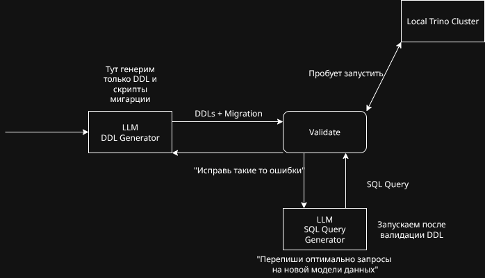

# Задача

В данном репозитории хранится код сервиса для оптимизаций SQL Trino для хакатона https://i.moscow/lct?erid=2VtzquWqidQ

Команда: 320

# Решение

Сервис поднимается через docker-compose.
В оркестре создаются следующие сервисы:

1. Trino (коннектор через Iceberg)
2. Postgres (для hivemetastore)
3. Hive metastore 
4. Fast Api HTTP Сервис
5. Оптимизатор

### Верхнеуровневая схема:

Оптимизатор работает асинхронно - по готовности берет еще не решенную задачу из DB.
Пользователь напрямую с оптимизатором не взаимодействует.

### Схема работы оптимизатора:

В качестве LLM используется открытая нейронка Qwen3-8b.
Провайдер: https://openrouter.ai/qwen/qwen3-8b

Оптимизация происходит в 2 шага:
1. Генерация DLL и скриптов миграции на новую схему
2. Генерация оптимальных SQL на основе новой схемы.

На каждом шаге сервис пытается запустить сгенерированные скрипты на локальном кластере.
На этом кластере самих данных нет, поэтому запросы отрабатывают быстро.

### Допущения
Чтобы успеть во временные рамки, сервис может прекратить генерить какие-нибудь скрипты, чтобы успеть сохранить текущие наработки в базу данных. 